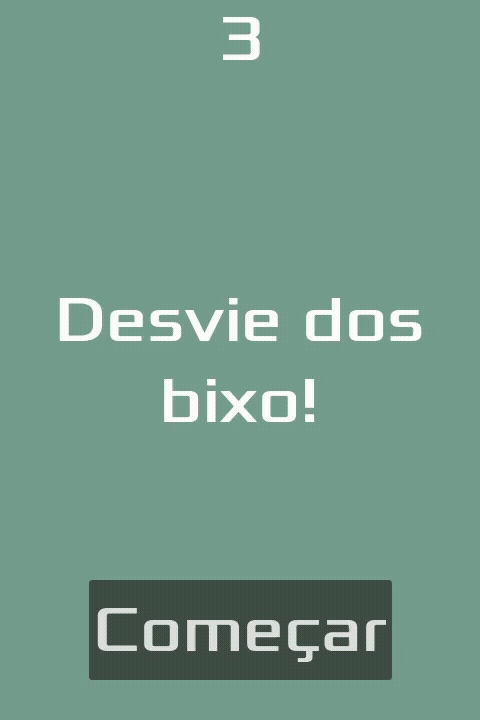

# Meu Primeiro Projeto 2D em Godot

Olá, esse é meu primeiro projeto 2D usando a Godot Engine. 
Trata-se de um jogo simples com geração aleatória de inimigos, pontuação e função de restart implementada.

